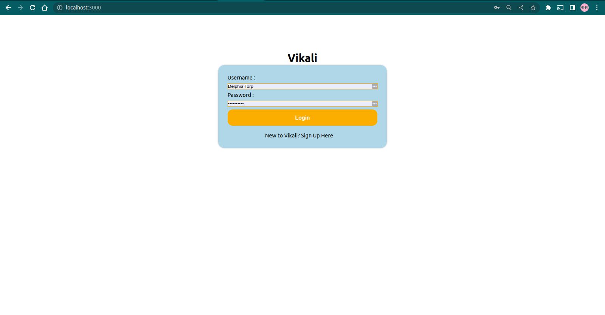
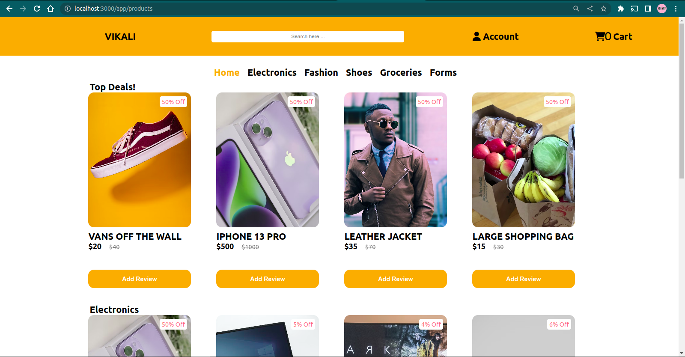
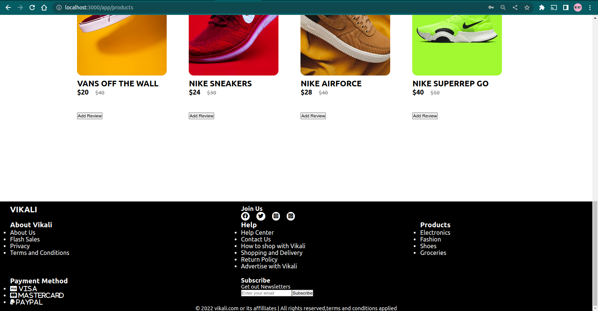

# VIKALI

### By Authors below:-

# Table of Contents

- [VIKALI](#vikali)
    - [By Authors below:-](#by-authors-below-)
- [Table of Contents](#table-of-contents)
  - [Description](#description)
  - [Technologies Used](#technologies-used)
  - [Project Preview](#project-preview)
  - [Overview](#overview)
  - [Setup](#setup)
  - [License](#license)
  - [Authors](#authors)

## Description

Vikali seeks to create an online store for consumers so that it is simple to shop for your favorite items from the vast array of online shopping websites that are readily available on the internet. One may make purchases online from the comfort of their homes using our website.

## Technologies Used

- ReactJS - used in the front-end to build interactive user interface
- CSS - to style and design of the website
- Material-UI - to display icons used
- Figma - outline user interface design
- Ruby and Sinatra -  for backend and database

## Project Preview

Once a user signs in, they are able to search for a product, add it to cart and leave a review on a particular product. Moreover, they are able to view their reviews on each product.

## Overview







## Setup

Below are steps required to run this project:

```json
Clone or fork the project repository

npm install - to install required dependencies
npm start - to get react-app running on a browser
```

## License

[MIT](https://choosealicense.com/licenses/mit/) CopyrightⒸ 2022 Vikali.

## Authors

- [Adams Wonderboy](https://github.com/adamswonder) - Scrum master
- [Joseph Njenga](https://github.com/JosephNjeruNjenga) - Front-end & Back-end Developer
- [Sharon Nyamongo](https://github.com/Sharonah8) - Front-end & Back-end Developer
- [Awadh Hassan](https://github.com/order6677) - Front-end & Back-end Developer
- [Barbra Mududa](https://github.com/Barbra-Mududa) - Front-end Developer & Figma Designer
